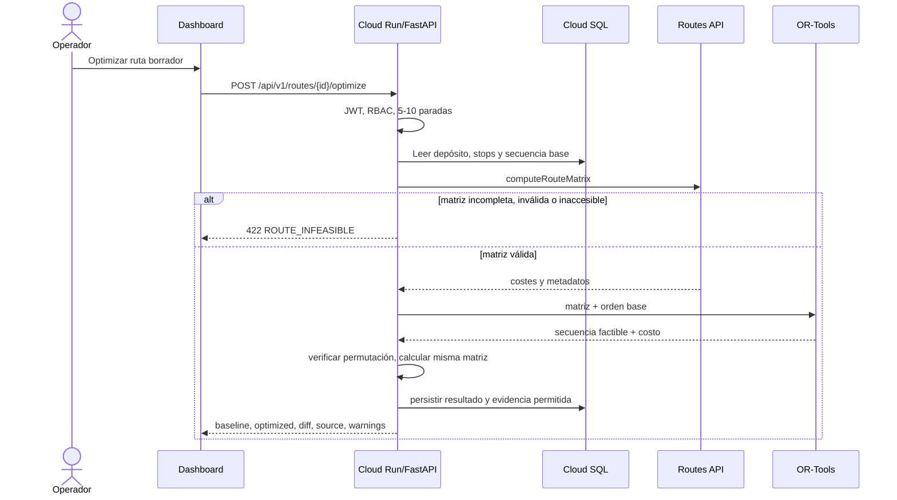

# Optimización — secuencia verificable

```mermaid
sequenceDiagram
 actor Operador
 participant UI as Dashboard
 participant API as Cloud Run/FastAPI
 participant DB as Cloud SQL
 participant Maps as Routes API
 participant Solver as OR-Tools
 Operador->>UI: Optimizar ruta borrador
 UI->>API: POST /api/v1/routes/{id}/optimize
 API->>API: JWT, RBAC, 5-10 paradas
 API->>DB: Leer depósito, stops y secuencia base
 API->>Maps: computeRouteMatrix
 alt matriz incompleta, inválida o inaccesible
   API-->>UI: 422 ROUTE_INFEASIBLE
 else matriz válida
   Maps-->>API: costes y metadatos
   API->>Solver: matriz + orden base
   Solver-->>API: secuencia factible + costo
   API->>API: verificar permutación, calcular misma matriz
   API->>DB: persistir resultado y evidencia permitida
   API-->>UI: baseline, optimized, diff, source, warnings
 end
```
Ruta no factible jamás se publica. El LLM no participa en el solver. La ruta base debe fijarse antes de optimizar para evitar sesgo.
